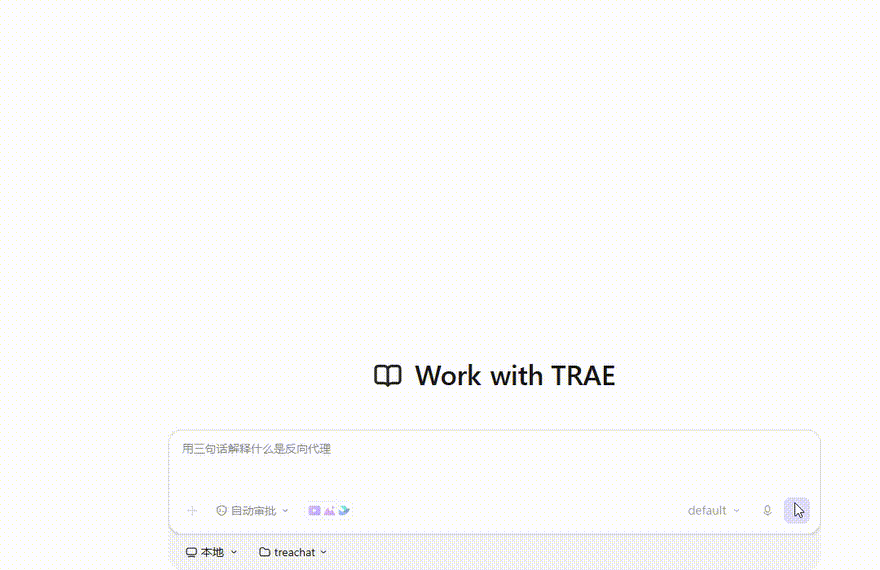
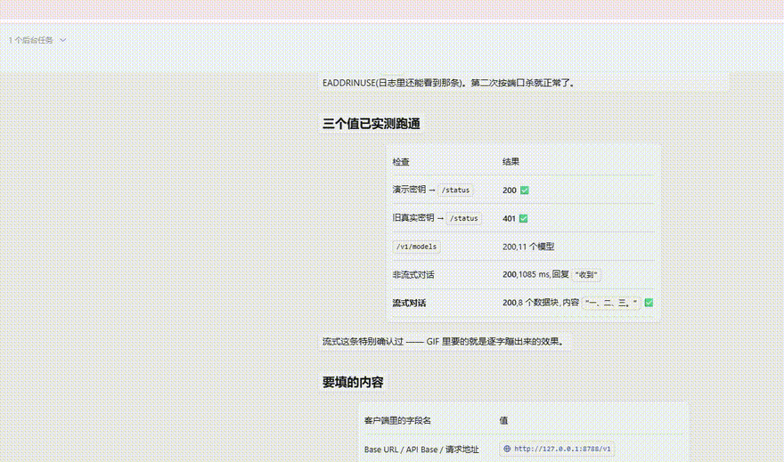
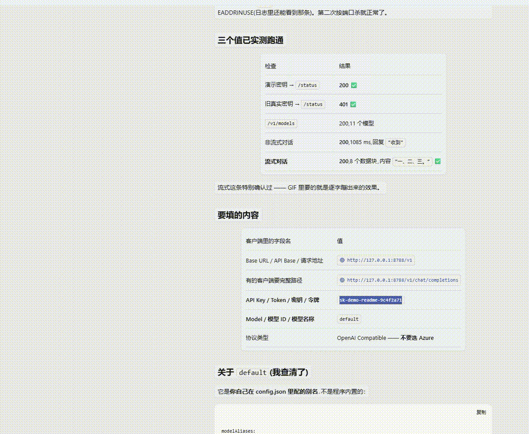

# workbuddy-openai-proxy

**Turn your WorkBuddy / CodeBuddy (Tencent) account quota into a local OpenAI- and
Anthropic-compatible API** — for Cursor, Claude Code, Codex CLI, Cherry Studio, or any
OpenAI-compatible client.

Covers **both editions**: China (`copilot.tencent.com`) and International
(`codebuddy.ai` / `workbuddy.ai`).

> Arrived here searching for `workbuddy2api` / `codebuddy2api` / `codebuddy2openai`? Those are mostly
> **self-hosted gateways**; this one is the **local, single-machine** take — zero dependencies,
> just `node server.mjs`. No Docker, no Redis, no pip. See
> [How it compares](#how-it-compares).

[中文文档](README.md) · [Features](#features) · [Quick start](#quick-start) · [FAQ](#faq)


### A look at it

**Wired into TraeWork as a custom model** — ask a question, and the answer streams back through the local proxy:



**Web console** — site status, model switching, usage stats, live logs:




---

## Overview

This is a **local HTTP proxy** that sits between your editor/tool and Tencent's CodeBuddy
service. It speaks the two protocols your tools already understand (OpenAI and Anthropic),
translates them into CodeBuddy's own private API, and forwards them using your existing
account.

```
┌─────────────────┐   OpenAI / Anthropic    ┌──────────────┐   CodeBuddy private API   ┌──────────────┐
│  Cursor         │   (what tools speak)    │   this proxy │   (what the service uses) │  CodeBuddy   │
│  Claude Code    │ ──────────────────────▶ │              │ ────────────────────────▶ │  cn / intl   │
│  Codex CLI      │ ◀────────────────────── │ 127.0.0.1    │ ◀──────────────────────── │              │
│  Cherry Studio  │      SSE streaming      │   :8788      │        SSE streaming      │              │
└─────────────────┘                         └──────────────┘                           └──────────────┘
```

**The problem it solves:** your CodeBuddy subscription gives you model quota, but that quota is
only reachable through Tencent's own clients. Your editor has no idea it exists. This proxy
exposes it as a standard API endpoint, so any tool that accepts a custom OpenAI/Anthropic base
URL can use your quota.

**What it is not:** it is not a key-sharing service, not a hosted API, and it does not create
accounts for you. It relays requests from *your* machine using *your* login, and stays on
loopback.

### What's in the box

```
workbuddy-openai-proxy/
├── server.mjs            # entry point (routing + auth + console mount)
├── login.mjs             # OAuth device-flow login (--site / --label / --list)
├── status.mjs            # per-site login state + remaining quota
├── ask.mjs               # one-shot CLI client, for verifying the proxy works
├── stop.mjs              # graceful shutdown via /admin/shutdown
├── console/index.html    # web console (single file, zero deps, light/dark themes)
└── src/
    ├── config.mjs        # config loading + validation with safe fallback
    ├── auth.mjs          # credential store, auto-refresh (single-flight), account selection
    ├── pool.mjs          # account pool: selection, exhaustion marking, backoff
    ├── compress.mjs      # context compression + token estimation
    ├── device-login.mjs  # OAuth device flow (shared by CLI and console)
    ├── headers.mjs       # site-aware upstream request headers
    ├── upstream.mjs      # upstream chat/models/quota + SSE parsing
    ├── router.mjs        # model → site routing
    ├── openai.mjs        # /v1/models, /v1/chat/completions
    ├── anthropic.mjs     # /v1/messages, /v1/messages/count_tokens
    ├── responses.mjs     # /v1/responses (Codex CLI)
    ├── console-api.mjs   # console backend
    ├── usage.mjs         # usage stats (per day / site / model)
    ├── util.mjs          # HTTP/SSE helpers
    └── log.mjs           # logging with in-memory ring buffer
```

Files created at runtime and **gitignored**: `config.json` (holds your local API key),
`auth.<site>.json` / `auth.<site>.pool.json` (credentials — **never commit these**),
`usage.json`, `.login-state.json`, `server.log`.

### How a request flows

1. Your tool POSTs to `http://127.0.0.1:8788/v1/chat/completions` with `Authorization: Bearer <apiKey>`.
2. The proxy picks a **site** (China or International) based on the model name you asked for —
   a bare model ID routes to whichever site serves it cheapest; `site/model` forces one.
3. It picks an **account** from that site's pool (skipping exhausted or cooling-down ones).
4. It refreshes the token if needed, trims the history if it exceeds the model window, and
   forwards the request upstream.
5. The upstream SSE stream is translated back into OpenAI or Anthropic frames and streamed
   to your tool as it arrives.
6. On quota exhaustion or repeated failures it rotates accounts automatically; on gateway
   errors or a missing model it falls back to another site.

---

## Why this one

There are several proxies for this service. This one is built around three constraints:

**1. Zero dependencies — literally.**

`dependencies` and `devDependencies` in `package.json` are both **empty**. All ~4,200 lines
run on Node built-ins alone. No `npm install`, no `node_modules`, no Docker, no supply-chain
surface. You can read the whole thing before running it.

Most tools in this space ask you to pull hundreds of transitive packages first. That's the
difference.

**2. It doesn't touch anything outside its own folder.**

Credentials, config, and logs all live inside the project directory. Login uses the official
OAuth device flow — the same one the official CLI uses. It does **not** read your WorkBuddy
client's local config, your browser profile, or any file outside its own directory.

**3. It stays on loopback.**

Binds `127.0.0.1:8788` only, with API-key auth, plus origin/Host validation on the console to
block cross-site token theft and DNS rebinding. See [Security](#security).

---

## Quick start

**Requires Node.js ≥ 18. Nothing else.**

```bash
git clone https://github.com/yuan240324/workbuddy-openai-proxy.git
cd workbuddy-openai-proxy
node server.mjs
```

Then open <http://127.0.0.1:8788/console>, click **Login**, authorize in the browser, done.

Point your client at:

| | |
|---|---|
| Base URL | `http://127.0.0.1:8788/v1` |
| API Key | the `apiKey` value in `config.json` (printed at startup, masked) |
| Model | any ID from `GET /v1/models`, or `default` |

### Platform notes

The core is pure Node built-ins with no native modules, so it should run anywhere Node does.
The **test suite** runs green on CI at Linux (`ubuntu-latest`) × Node 18/20/22/24;
**end-to-end runs against real upstream accounts have only been verified on Windows + Node 24** —
macOS and other combinations: reports welcome.

| | Windows | macOS | Linux |
|---|---|---|---|
| **Run** | `node server.mjs` or double-click `start.cmd` | `node server.mjs` | `node server.mjs` |
| **Run in background** | `start-hidden.vbs` (fully hidden) | `nohup node server.mjs >server.log 2>&1 &` | same as macOS |
| **Stop** | `stop.cmd` | `node stop.mjs` | `node stop.mjs` |
| **Console** | desktop shortcut / `console-open.vbs` | open <http://127.0.0.1:8788/console> | same as macOS |
| **Autostart** | shortcut to `start-hidden.vbs` in Startup folder | see launchd below | see systemd below |
| **Login** | opens default browser | opens default browser | opens default browser; use `--no-open` on headless |

<details>
<summary>macOS autostart (launchd)</summary>

Save as `~/Library/LaunchAgents/com.local.workbuddy-proxy.plist` (adjust paths):

```xml
<?xml version="1.0" encoding="UTF-8"?>
<!DOCTYPE plist PUBLIC "-//Apple//DTD PLIST 1.0//EN" "http://www.apple.com/DTDs/PropertyList-1.0.dtd">
<plist version="1.0"><dict>
  <key>Label</key><string>com.local.workbuddy-proxy</string>
  <key>ProgramArguments</key>
  <array>
    <string>/usr/local/bin/node</string>
    <string>/Users/you/workbuddy-openai-proxy/server.mjs</string>
  </array>
  <key>WorkingDirectory</key><string>/Users/you/workbuddy-openai-proxy</string>
  <key>RunAtLoad</key><true/>
  <key>KeepAlive</key><true/>
</dict></plist>
```

```bash
launchctl load ~/Library/LaunchAgents/com.local.workbuddy-proxy.plist
```

</details>

<details>
<summary>Linux autostart (systemd --user)</summary>

Save as `~/.config/systemd/user/workbuddy-proxy.service`:

```ini
[Unit]
Description=WorkBuddy OpenAI Proxy
After=network.target

[Service]
WorkingDirectory=%h/workbuddy-openai-proxy
ExecStart=/usr/bin/node %h/workbuddy-openai-proxy/server.mjs
Restart=on-failure

[Install]
WantedBy=default.target
```

```bash
systemctl --user daemon-reload
systemctl --user enable --now workbuddy-proxy
loginctl enable-linger $USER      # keep running when logged out
```

</details>

<details>
<summary>Logging in on a headless machine (SSH / server)</summary>

Login is a browser-based device-code flow. On a box with no GUI:

```bash
node login.mjs --site cn-cli --no-open
# prints an authorization URL — open it in a browser on your own machine,
# authorize, and the script will pick up the result automatically.
```

</details>

---

## Features

- **Zero dependencies** — Node.js ≥ 18 only. No `npm install`, no Docker.
- **Two editions, one service** — China and International are protocol-compatible; the proxy
  routes by model across both. *Quota is not shared between them* — each needs its own login.
- **Account pool** — put multiple accounts under one site; automatically rotates when an
  account runs out of quota or starts failing. See below.
- **Context compression** — long conversations are trimmed to fit the model window instead of
  bouncing a raw upstream `400 prompt is too long`.
- **Both protocols** — `/v1/chat/completions` (OpenAI) and `/v1/messages` (Anthropic), plus
  `/v1/responses` for Codex CLI and other Responses-API clients.
- **Full tool calling** — streaming `tool_calls` aggregation and multi-turn tool result
  replay. Works with agent-style clients.
- **Web console** — model list, quota, per-account management, live logs, light/dark themes.
- **Resilience** — automatic token refresh, connection-level retry with backoff, automatic
  fallback to another site on gateway errors or missing models.

---

## How it compares

There are already a number of projects in this niche (usually named `workbuddy2api` /
`codebuddy2api` / `codebuddy2openai`). Nearly all of them are **self-hosted gateways** — built for
an always-on box, or for several people sharing one quota pool — which is why they reach for
Docker / Redis / FastAPI.

This project makes a different bet: **it is meant for the machine you're sitting at.**

| | This project | Typical `*2api` gateway |
|---|---|---|
| **Runtime dependencies** | **zero** (Node built-ins only) | 2–10; commonly Redis, FastAPI |
| **Install** | `git clone` + `node server.mjs` | Docker Compose, or `pip install` + venv |
| OpenAI Chat Completions | ✅ | ✅ |
| Anthropic Messages | ✅ `/v1/messages` | usually |
| OpenAI Responses (Codex CLI) | ✅ `/v1/responses` | sometimes |
| Web console | ✅ built in | often absent, or a separate project |
| Account pool | ✅ local, multi-account | ✅ some support cross-machine sharing |
| Listen scope | `127.0.0.1` only | usually exposed as a service |
| Built for | **one person, one machine** | server / shared access |

> The table reflects a survey of public repos in 2026-09, comparing only **objectively checkable
> things** (dependency count, deployment method, protocol support). This niche moves fast —
> always trust each project's own latest README.

**When is this the wrong choice?** If what you want is "one server hosting several people's
accounts with a shared quota pool", this project's design (loopback-only, single-user) is not it —
use one of the gateway projects instead.

### Account pool

Add a second account by logging in again — same `uid` updates in place, a new `uid` is added:

```bash
node login.mjs --site intl-cli --label backup-1
node login.mjs --list                      # show all pools
```

Selection order: not-exhausted → fewest consecutive failures → least-recently-used (so load
spreads across accounts).

Rotation triggers:

| Condition | Behavior |
|---|---|
| Quota exhausted (429 / `insufficient credits`) | Marked exhausted, rotate; retried after 6h |
| `401` / `403` | Refresh that account's token in place first, rotate only if it still fails |
| `5xx` / gateway errors | Backoff cooldown (30s → 2m → 10m → 30m), then rotate |
| All accounts on a site exhausted | Falls back to another site if it also serves that model |

**No migration needed.** If no pool file exists, the existing single-account credential is
used as-is — behavior is identical to before. The pool file is only written once you add a
second account.

### Context compression

Upstream enforces an input limit and returns `400 prompt is too long` when exceeded. This
proxy trims the history to fit, then retries if the upstream still rejects it.

Rules: the `system` prompt is never dropped; oldest messages go first; the last 4 messages are
always kept; an `assistant` message with `tool_calls` is never separated from its `tool`
results (splitting them makes the upstream reject the request); a single oversized message has
its own content truncated.

Tunable in `config.json`:

```jsonc
"context": {
  "enabled": true,
  "reserveForOutput": 4096,   // tokens reserved for the reply
  "minKeepMessages": 4,       // always keep the N most recent
  "safetyRatio": 0.95         // headroom for estimation error
}
```

Set `"enabled": false` to restore pass-through behavior.

---

## Client setup

Adding a custom model in TraeWork — the whole flow, from filling in the dialog to the model appearing in the list:



<details>
<summary>Cursor</summary>

Settings → Models → OpenAI API:
- Base URL: `http://127.0.0.1:8788/v1`
- API Key: from `config.json`

</details>

<details>
<summary>Claude Code (Anthropic protocol)</summary>

```bash
export ANTHROPIC_BASE_URL=http://127.0.0.1:8788
export ANTHROPIC_API_KEY=<your apiKey>
```

</details>

<details>
<summary>Codex CLI (`/v1/responses`)</summary>

Point it at `http://127.0.0.1:8788/v1` with `wire_api = "responses"`.

</details>

<details>
<summary>Any OpenAI-compatible client</summary>

Base URL `http://127.0.0.1:8788/v1`, Bearer auth with your `apiKey`.

</details>

---

## Which models can I use?

It depends on your plan — **the authoritative list is whatever `GET /v1/models` returns**.
A typical China-edition account sees:

| Model ID | Context / max output |
|---|---|
| `deepseek-v4-pro` | 1M / 50k |
| `deepseek-v4.1-flash` | 1M / 128k |
| `glm-5.3` / `glm-5.3-flash` | 1M / 48k |
| `kimi-k2.7` / `kimi-k3-1` | 256k / 32k · 1M / 32k |
| `minimax-m3` | 512k / 128k |
| `hy4-preview` / `hy3` | 1M / 64k |
| `glm-5v-turbo` (vision) | 200k / 64k |
| `auto` | 168k / 32k |

The **International** edition additionally exposes Claude, GPT and Gemini models
(`claude-sonnet-4.6`, `claude-opus-4.6`, `gpt-5.5`, `gemini-3.1-pro`, …). On the China edition
those return `400 only available for authorized users` unless your plan includes them.

**Routing:** write a bare model ID and the proxy picks the cheapest site serving it; or force
one with `site/model` (e.g. `intl-cli/claude-sonnet-4.6`).

---

## API

| Path | Method | Description |
|---|---|---|
| `/v1/models` | GET | Merged model list from all logged-in sites, with `site` and `credits` multiplier |
| `/v1/chat/completions` | POST | OpenAI-compatible (streaming / non-streaming, tool calling) |
| `/v1/responses` | POST | OpenAI Responses API compatibility layer |
| `/v1/messages` | POST | Anthropic Messages (full streaming event sequence) |
| `/v1/messages/count_tokens` | POST | Token estimation |
| `/status` | GET | Per-site login state and remaining quota |
| `/health` | GET | Health check (no auth) |

The `/v1` prefix is optional. Auth via `Authorization: Bearer <apiKey>` or `x-api-key: <apiKey>`.

`apiKey` may also be a **string array**, where every entry is equally valid — handy for issuing
different keys to several clients (or a temporary demo/recording key) without editing the config
and restarting:

```jsonc
{
  // both forms work: a single string, or an array of strings
  "apiKey": ["sk-wb-your-main-key", "sk-demo-key-for-demos"]
}
```

The bundled scripts (`ask.mjs` / `status.mjs` / `stop.mjs`) and the startup banner always use
**the first entry** as the primary key; the console only ever shows its masked form.

---

## FAQ

| Symptom | Fix |
|---|---|
| `404 unknown path POST /v1/messages/chat/completions` | Client duplicated the path segment. Use the base URL `http://127.0.0.1:8788/v1` |
| `401 not logged in` | Run `node login.mjs --site <site>` |
| `401 session expired` | Refresh token expired — log in again |
| `402 insufficient quota` | That site's quota is used up (quota is per-site, not shared) |
| `429 rate limited` | Back off, reduce concurrency |
| International returns 401/500 but China works | Separate account systems — log in with `--site intl-cli` |
| Response gets truncated | Upstream counts reasoning tokens as output; raise the output window in your client |
| Empty model list in client | Some clients don't call `/v1/models` — type the model ID manually |
| `port already in use` | Another instance is running: `node stop.mjs` |
| Long conversations fail | Should be handled automatically now — please open an issue with the error text |
| How is this different from `workbuddy2api` / `codebuddy2api`? | Those are mostly **self-hosted gateways** (often Docker / Redis, built for shared access); this one is the **local single-machine** take (zero deps, loopback only). Side-by-side table: [How it compares](#how-it-compares) |
| Do I need Python / Docker / Redis? | No. Node.js ≥ 18 is the only requirement — `node server.mjs` |
| How do I give several clients different keys? | Make `apiKey` a string array in `config.json`; every entry is valid. See [API](#api) |

---

## Testing

Zero dependencies, Node's built-in test runner, no `npm install`:

```bash
npm test        # or: node --test --test-reporter=spec test/*.test.mjs
```

CI ([`.github/workflows/ci.yml`](.github/workflows/ci.yml)) runs the syntax check and the full suite on
**Linux (`ubuntu-latest`) × Node 18 / 20 / 22 / 24**, and deliberately skips `npm install` — that itself
is a continuous check of the zero-dependency claim. A second job guards the claim directly: no declared
dependencies, no `node_modules` or lockfile, and every `src/` module imports cleanly without them.

**392 tests passing**, covering config validation, credential refresh, account-pool rotation,
context compression, protocol translation (OpenAI ↔ Anthropic ↔ Responses), SSE aggregation,
timeouts, and an end-to-end security suite (console origin checks, DNS rebinding, auth).

---

## Security

- Listens on `127.0.0.1` only. Credential files are mode `0600` and gitignored — **never share
  or commit them**.
- Uses the **same non-public endpoints as the official CodeBuddy CLI**. They are undocumented
  and may change without notice. This project only relays traffic for local personal use.
- **Use it with your own account only**, and comply with the Tencent CodeBuddy / WorkBuddy
  terms of service. Quota rules and abuse detection are controlled by the upstream.
- Not affiliated with, authorized by, or endorsed by Tencent. Evaluate the risk yourself.

**Loopback is not automatically safe.** Any web page you visit can also reach a local server,
so the console enforces:

- Console page and API accept only loopback `Origin`, validate `Host` (DNS-rebinding defense),
  and send `X-Frame-Options: DENY`.
- Console responses never send `Access-Control-Allow-Origin: *`, so a cross-site page can't
  read the session token injected into the page.
- `/v1/*` keeps permissive CORS (in-browser clients need it) but is always behind `apiKey`.

If `apiKey` is empty (or an empty array) the server prints a startup warning. Keep a random key.

---

## Credits

Protocol details were informed by these open-source projects (this codebase is an independent
rewrite; only interface shapes and field conventions were referenced):

- [Sliverkiss/workbuddy2api](https://github.com/Sliverkiss/workbuddy2api) (Go, MIT) — OAuth
  device flow, upstream endpoints and header conventions, SSE frame normalization
- [rocky99261/workbuddy-proxy](https://github.com/rocky99261/workbuddy-proxy) (Python) —
  account headers (uid / enterpriseId / domain) and IDE-side call shapes
- [maiphucgiang/codebuddy2api](https://github.com/maiphucgiang/codebuddy2api) (Python) —
  China/International domain split, credit multiplier and non-shared quota semantics

Trae / TraeWork / CodeBuddy / WorkBuddy are trademarks of their respective owners. This
project is not affiliated with those companies.

---

## License

[MIT](LICENSE)
