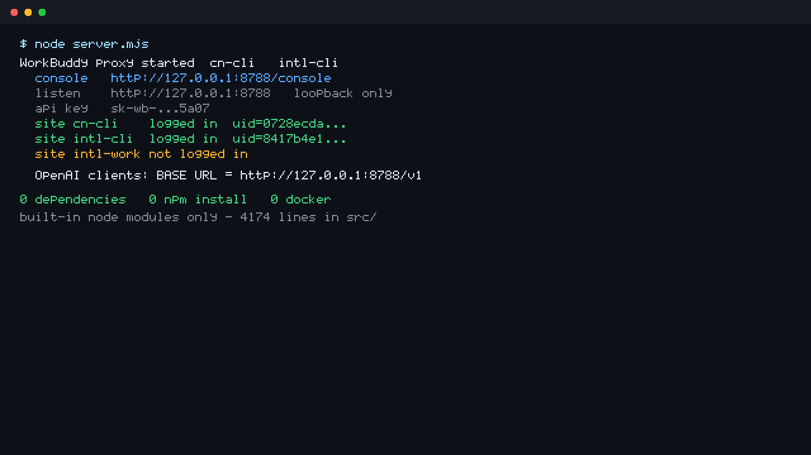
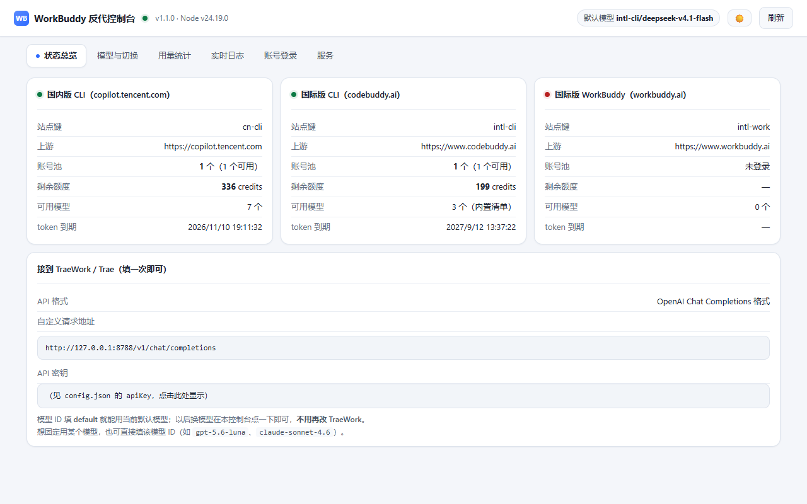
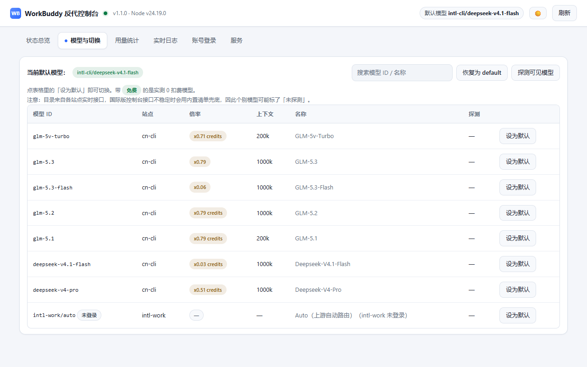

# workbuddy-openai-proxy

[English](README.en.md) · **中文**

把 **WorkBuddy / CodeBuddy 账号额度（国内版 + 国际版）**
包装成本机上的 **OpenAI 兼容 + Anthropic 兼容** 接口，供 **TraeWork / TRAE / TraeCode CLI / Cherry Studio / Cursor** 等
任意 OpenAI 兼容客户端当作「自定义模型」接入。


> 跨平台说明见下方「三平台差异」。核心逻辑只用 Node 内置模块、无原生依赖，
> 理论上 Windows / macOS / Linux 都能跑；但**目前只在 Windows + Node 24 上实测过**，
> 其他平台欢迎反馈（见 §12 的已知边界）。

<!-- 演示 GIF 待补：录好后放 docs/demo.gif，替换下面的静态截图 -->

### 看一眼







---

## 30 秒上手（不用装任何东西）

**只需要 Node.js ≥ 18。** 没有 `npm install`，没有 `node_modules`，没有 Docker，
没有全局 CLI，没有配置文件要抄。

```bash
git clone https://github.com/yuan240324/workbuddy-openai-proxy.git
cd workbuddy-openai-proxy
node server.mjs
```

然后浏览器打开 <http://127.0.0.1:8788/console>，点一下「登录」授权，就能用了。

> **为什么强调这个**：这类工具大多要先跑 `npm install` 拉几百个包、或架 Docker。
> 本项目 `dependencies` 和 `devDependencies` **都是空的** —— 全部 4100 行源码只依赖 Node 内置模块。
> 你可以直接读源码确认，没有供应链风险。

### 三平台差异

| | Windows | macOS | Linux |
|---|---|---|---|
| **启动** | `node server.mjs`<br>或双击 `start.cmd` | `node server.mjs` | `node server.mjs` |
| **后台常驻** | 双击 `start-hidden.vbs`（完全隐藏） | `nohup node server.mjs >server.log 2>&1 &` | `nohup node server.mjs >server.log 2>&1 &` |
| **停止** | `stop.cmd`（或关掉窗口） | `node stop.mjs` | `node stop.mjs` |
| **打开控制台** | 桌面快捷方式 / `console-open.vbs` | 浏览器手动开 <http://127.0.0.1:8788/console> | 同 macOS |
| **开机自启** | 启动文件夹放 `start-hidden.vbs` 快捷方式 | 见下方 launchd | 见下方 systemd |
| **登录授权** | 自动弹出默认浏览器 | 自动弹出默认浏览器 | 自动弹出；无桌面环境用 `--no-open` |

<details>
<summary>macOS 开机自启（launchd）</summary>

存为 `~/Library/LaunchAgents/com.local.workbuddy-proxy.plist`（路径按实际改）：

```xml
<?xml version="1.0" encoding="UTF-8"?>
<!DOCTYPE plist PUBLIC "-//Apple//DTD PLIST 1.0//EN" "http://www.apple.com/DTDs/PropertyList-1.0.dtd">
<plist version="1.0"><dict>
  <key>Label</key><string>com.local.workbuddy-proxy</string>
  <key>ProgramArguments</key>
  <array>
    <string>/usr/local/bin/node</string>
    <string>/Users/你/反代/server.mjs</string>
  </array>
  <key>WorkingDirectory</key><string>/Users/你/反代</string>
  <key>RunAtLoad</key><true/>
  <key>KeepAlive</key><true/>
</dict></plist>
```

```bash
launchctl load ~/Library/LaunchAgents/com.local.workbuddy-proxy.plist
```

</details>

<details>
<summary>Linux 开机自启（systemd --user）</summary>

存为 `~/.config/systemd/user/workbuddy-proxy.service`：

```ini
[Unit]
Description=WorkBuddy OpenAI Proxy
After=network.target

[Service]
WorkingDirectory=%h/反代
ExecStart=/usr/bin/node %h/反代/server.mjs
Restart=on-failure

[Install]
WantedBy=default.target
```

```bash
systemctl --user daemon-reload
systemctl --user enable --now workbuddy-proxy
loginctl enable-linger $USER      # 未登录也保持运行
```

</details>

<details>
<summary>无桌面环境（SSH / 服务器）怎么登录</summary>

登录是浏览器授权的设备码流程，无头机器上这样走：

```bash
node login.mjs --site cn-cli --no-open
# 终端会打印一条授权链接 → 复制到你自己电脑的浏览器打开并授权
# 授权完成后脚本会自动轮询到结果，凭证落盘
```

</details>

---

## 特性

- **零依赖**：仅需 **Node.js ≥ 18**，不用 npm install、不用 Docker。
- **隔离**：配置 / 凭证 / 日志全部落在**项目目录内**；登录走官方**设备授权（OAuth）**，
  不读取 WorkBuddy 客户端的本地配置、浏览器数据或任何项目目录以外的文件。
- **监听**：默认只绑 `127.0.0.1:8788`，不对局域网/公网暴露，带本地 API Key 鉴权。
- **多站点**：国内版（`copilot.tencent.com`）与国际版（`codebuddy.ai` / `workbuddy.ai`）协议同构，
  一套服务同时代理、按模型自动路由；两边额度互不通用，各自登录。
- **账号池**：同一站点可放多个账号，额度耗尽或请求失败自动换号（见 §5.2）。
- **上下文压缩**：超长会话自动裁剪，不再直接吃上游 400（见 §6）。
- **能力**：流式 / 非流式、完整工具调用（tool_calls 流式聚合、多轮回灌）、
  `developer` 角色与 `tool_choice` 归一、accessToken 临期自动刷新、剩余积分与**积分倍率**查询、
  模型白/黑名单过滤、上游连接级重试与站点自动降级。
- **另含 `/v1/responses`**（OpenAI Responses API 兼容层），供 Codex CLI / 桌面端接入，见 §9。
> ℹ️ 本分支（`main`）只包含 CodeBuddy / WorkBuddy 相关能力。
> **DeepSeek 官方站点**（`chat.deepseek.com`，协议不同）的实现在 `deepseek` 分支上。

---

## 1. 目录结构

```
workbuddy-openai-proxy/
├── server.mjs            # 服务入口（路由 + 鉴权 + 路径后缀容错 + 控制台挂载）
├── console-open.mjs      # 打开控制台窗口（服务没启动会自动拉起）
├── console-open.vbs      # 隐藏窗口调用上面那个（桌面快捷方式用）
├── login.mjs             # 设备授权登录（--site 选站点 / --label 命名账号 / --list 看号池）
├── status.mjs            # 查看各站点登录状态 + 剩余积分
├── ask.mjs               # 命令行提问客户端（验证代理是否正常）
├── stop.mjs              # 通过 /admin/shutdown 优雅停止服务
├── start.cmd             # 双击启动（前台，带日志）
├── start-hidden.cmd      # 双击启动（最小化窗口，后台常驻）
├── start-hidden.vbs      # 完全隐藏启动（桌面「启动反代」快捷方式用）
├── stop.cmd / status.cmd / login.cmd / login-intl.cmd / ask.cmd
├── config.example.json   # 配置样例（复制为 config.json 后按需修改）
├── package.json          # 仅用于 npm test（无任何运行时依赖）
├── LICENSE               # MIT
├── test/                 # 测试（node:test，零依赖，见「测试」一节）
│   └── *.test.mjs
├── console/
│   └── index.html        # 控制台界面（单文件、零依赖、中文界面、深/浅双主题）
└── src/
    ├── config.mjs        # 配置加载 + 校验降级 + 站点表（国内版 / 国际版）
    ├── auth.mjs          # 多站点凭证存取 + 自动刷新（单飞）+ 运行中热加载
    ├── pool.mjs          # 账号池：选号 / 额度耗尽标记 / 失败退避 / 轮询分摊
    ├── compress.mjs      # 上下文压缩：超长裁剪 + 中文感知 token 估算
    ├── device-login.mjs  # 设备授权登录（CLI 与控制台共用）
    ├── headers.mjs       # 站点感知的上游请求头
    ├── upstream.mjs      # 上游聊天/模型/额度接口 + SSE 解析
    ├── router.mjs        # 模型 → 站点 路由（default 别名 / 前缀 / 路由表 / 目录匹配）
    ├── openai.mjs        # /v1/models、/v1/chat/completions
    ├── anthropic.mjs     # /v1/messages、/v1/messages/count_tokens
    ├── console-api.mjs   # 控制台后端接口（状态/模型/切换/日志/用量/探测/登录/停服）
    ├── usage.mjs         # 用量统计（按天/站点/模型，落盘 usage.json）
    ├── util.mjs          # HTTP/SSE 小工具
    └── log.mjs           # 日志（含内存环形缓冲，供控制台实时查看）
```

运行时自动生成、**已被 .gitignore 忽略**的文件：`config.json`（含本地 API Key）、
`auth.<站点>.json`（各站点登录凭证，如 `auth.cn-cli.json`）、`auth.<站点>.pool.json`（账号池）、
`usage.json`（用量统计）、`.login-state.json`、`server.log` / `console.log`。

启动后会打印每个站点的登录状态：

```
站点 cn-cli    已登录 uid=xxxxxxxx…   https://copilot.tencent.com
站点 intl-cli  未登录                 https://www.codebuddy.ai
站点 intl-work 未登录                 https://www.workbuddy.ai
未登录的站点可用：node login.mjs --site <站点名>
```

---

## 2. 启动 / 停止服务

```powershell
node server.mjs          # 前台运行（日志直接打在终端，Ctrl+C 停止）
```

双击脚本更省事：

| 脚本 | 作用 |
|---|---|
| **桌面「WorkBuddy 控制台」快捷方式** | 打开控制台独立窗口（服务没启动会自动拉起） |
| `console-open.vbs` / `console-open.mjs` | 同上（命令行版）：静默启动服务 → 用 Edge 应用模式开无地址栏窗口 |
| `start.cmd` | 前台启动（带日志，关窗口即停） |
| `start-hidden.cmd` | 后台最小化启动 |
| `start-hidden.vbs` | 完全隐藏启动，日志写入 `server.log`（桌面「启动 WorkBuddy 反代」快捷方式用的就是它） |
| `stop.cmd` | 停止服务（调 `/admin/shutdown`，不依赖 WMI/进程枚举） |
| `status.cmd` | 查看各站点登录态 + 剩余积分 |
| `ask.cmd` / `ask.mjs` | 命令行提问，用来验证代理是否正常 |
| `login.cmd` / `login-intl.cmd` | 登录国内版 / 选择国际版站点 |

启动后终端会打印：

```
控制台：http://127.0.0.1:8788/console   ← 建议用桌面快捷方式打开
监听地址：http://127.0.0.1:8788   （仅本机可达）
API Key：<你的本地 API Key>（首次启动自动生成）
默认站点/模型：cn-cli / deepseek-v4-pro
站点 cn-cli    已登录 uid=xxxxxxxx…   https://copilot.tencent.com
站点 intl-cli  已登录 uid=xxxxxxxx…   https://www.codebuddy.ai
站点 intl-work 未登录                 https://www.workbuddy.ai
```

> **Key 与 URL 只需填一次**：它们保存在 `config.json` 里，重启服务/重启电脑都不变；
> 只有删掉 `config.json`（会重新随机生成 Key）或改 `port`（URL 会变）才需要重新填。

自检：

```powershell
status.cmd                              # 各站点登录态 + 剩余积分
node ask.mjs --list                     # 列出全部模型（含站点与积分倍率）
node ask.mjs claude-sonnet-4.6 "你好"    # 直接提问，会显示是哪个站点接的
```

---

## 3. 控制台（类 CC Switch 的一体化管理界面）

双击桌面「**WorkBuddy 控制台**」快捷方式即可：服务没启动会**自动静默拉起**，然后用 Edge 的
**应用模式**打开一个**无地址栏的独立窗口**（看起来就是个桌面客户端）。也可以直接访问
`http://127.0.0.1:8788/console`。

| 页签 | 能做什么 |
|---|---|
| **状态总览** | 各站点登录态、剩余额度、可用模型数、token 到期时间；TraeWork 该填的 URL 与密钥 |
| **模型与切换** | 列出全部站点模型（标注积分倍率、`免费` 徽章），点「设为默认」即完成切换；支持搜索、批量探测可用性 |
| **用量统计** | 今日 / 累计调用次数、token、credit 消耗；最近 7 天柱状图；按模型排行；可一键清空 |
| **实时日志** | 最近 500 条日志滚动刷新，请求日志按状态着色 |
| **账号登录** | 在界面里发起国内版 / 国际版设备授权登录（给出链接、自动轮询），也可退出登录 |
| **服务** | 查看运行时长 / 版本 / 监听地址，一键停止服务 |

安全性：控制台页面只监听本机；页面里注入的是**每次启动随机生成的会话令牌**（不是 `apiKey`），
控制台接口只认这个令牌或 `apiKey`，错误令牌返回 401。控制台只读写本项目目录内的文件。

---


## 4. TraeWork 接入（桌面版）

> 官方限制：**仅 TraeWork 桌面版支持添加自定义模型**，且自定义模型**只在本地环境可用**。

**设置 → 模型 → 添加模型 → 选择「自定义模型」**，按下表填写：

| 参数 | 填写值 |
|---|---|
| API 格式 | **OpenAI Chat Completions 格式**（推荐） |
| 自定义请求地址 | 打开 **完整 URL** 开关，填 `http://127.0.0.1:8788/v1/chat/completions` |
| 模型 ID | **`default`**（推荐，见下方说明）或任意具体模型 ID |
| 模型展示名称 | 例如 `WorkBuddy` |
| API 密钥 | `config.json` 里的 `apiKey` |

> **强烈建议模型 ID 填 `default`**：它是个虚拟模型，指向控制台里设置的「默认模型」。
> 以后想改用 Claude / GPT / GLM，只需在控制台点一下切换，**TraeWork 那边一个字都不用改**。
> 也可以用站点前缀强制指定，例如 `intl-cli/claude-sonnet-4.6`。

**高级配置**（建议）：

| 参数 | 建议值 |
|---|---|
| 模型系列 | 用 `deepseek-v4-pro` 选 **DeepSeek-4 系列**（自动开思考模式 + 推荐超参）；用 GLM/Kimi 选「默认」 |
| 上下文窗口 | 输入 `1000000`、输出 `65536`（可留空用默认） |
| 工具调用轮数 | 留空（用默认） |
| 支持图片输入 | 仅当模型支持视觉（如 `glm-5v-turbo`）才勾选 |
| 采样参数 | 留空即可 |

要改用 **Anthropic Messages 格式**（Claude 型）也可以：完整 URL 填 `http://127.0.0.1:8788/v1/messages`，其余字段同上。

**关于「完整 URL」开关**（两种填法都对，任选其一，别混用）：

| API 格式 | 打开「完整 URL」→ 填完整地址 | 关闭「完整 URL」→ 填基础地址（TraeWork 自己拼路径） |
|---|---|---|
| OpenAI Chat Completions | `http://127.0.0.1:8788/v1/chat/completions` | `http://127.0.0.1:8788/v1` |
| Anthropic Messages | `http://127.0.0.1:8788/v1/messages` | `http://127.0.0.1:8788/v1` |

> 服务端已做**路径后缀容错**：只要路径里含有 `/chat/completions`（按 OpenAI 处理）或 `/messages`（按 Anthropic 处理）就能命中，
> 所以即使客户端拼出 `/v1/messages/chat/completions`、`/v1/v1/chat/completions` 这类组合也不会再报 404。

> 提示：TraeWork 点「添加模型」时会**调用一次接口做密钥校验**，会真实消耗极少量额度——只要代理已启动且已登录就会通过。

### 4.1 TraeCode CLI（`trae_cli.yaml`）

```yaml
models:
  - name: "WorkBuddy-DeepSeek"
    open_ai:
      base_url: http://127.0.0.1:8788/v1
      api_key: "<你的本地 API Key>"
      model: deepseek-v4-pro
  - name: "WorkBuddy-GLM"
    open_ai:
      base_url: http://127.0.0.1:8788
      api_key: "<你的本地 API Key>"
      model: glm-5.3
```

### 4.2 TRAE IDE

**设置 → 模型 → 添加自定义模型**，Base URL 填 `http://127.0.0.1:8788/v1`（或 `http://127.0.0.1:8788`，两种都兼容），
API Key 与模型 ID 同上。

---

## 5. 多站点（国内版 + 国际版）

国内版与国际版**协议同构**（同一套 `/v2/plugin/auth/*` 设备授权、`/v2/chat/completions`、`/v2/billing/meter/*`），
只有域名与身份头不同，因此本项目用一张站点表统一管理：

| 站点键 | 说明 | 上游域名 |
|---|---|---|
| `cn-cli` | 国内版 CLI / IDE | `copilot.tencent.com` |
| `intl-cli` | 国际版 CLI / IDE | `www.codebuddy.ai` |
| `intl-work` | 国际版 WorkBuddy | `www.workbuddy.ai` |

> ⚠️ **额度不通用**：国内版与国际版是两套独立账号与余额（上游明确「每个账号保留自己的模型目录与余额」），
> credit 单价也不同。国际版需要单独注册、单独登录，额度不会互通。

### 5.1 分别登录

```powershell
node login.mjs                      # 默认站点 cn-cli（国内版）
node login.mjs --site intl-cli      # 国际版 CLI（codebuddy.ai）
node login.mjs --site intl-work     # 国际版 WorkBuddy（workbuddy.ai）
```

每个站点的凭证单独存在 `auth.<site>.json`，互不影响；国际版页面若无账号可直接注册。

> 登录页面可能存在两道步骤：**账号登录** → **CLI 授权确认**。只完成前者时上游会持续返回
> `11217: login ing...`，需要在授权页点一次「授权 / 允许」才会下发 token。

### 5.1.1 国际版实测可用模型（`intl-cli`）

国际版的「控制台模型目录」接口在网关侧受限（`403 access_denied` / 偶发 500），
因此项目为它内置了一份**实测可用清单**（`sites.intl-cli.seedModels`，可自行增删）：

| 模型 ID | 说明 |
|---|---|
| `gpt-6-astra` | GPT-6 Astra（上新中，上游 provider 偶发不可用） |
| `gpt-5.6-luna` · `gpt-5.6-terra` · `gpt-5.6-sol` | GPT-5.6 三个代号版本（`sol` 偶发不可用） |
| `gpt-5.5` · `gpt-5.4` · `gpt-5.3-codex` | 上一代 GPT 与 Codex 变体 |
| `claude-sonnet-4.6` · `claude-opus-4.6` | **Claude 系（国内版没有）**，实测为真 Claude |
| `gemini-3.1-pro` · `gemini-3.5-flash` · `gemini-3.1-flash-image` | **Gemini 系（国内版没有）** |
| `deepseek-v4.1-flash` | 实测 **0 扣费**（国内版同名模型按 x0.03 收费） |
| `glm-5.3` · `glm-5.2` · `kimi-k3` · `kimi-k2.7` · `kimi-k2.6` · `kimi-k2.5` · `minimax-m3` · `hy3` | 与国内版有交集的模型 |
| `auto` | 上游自动路由 |

**实测参考单价**（≈2.4k token 输入一次调用，来自响应里的 `usage.credit`）：

| 模型 | 扣费 credit | 每 1k 输入 token |
|---|---|---|
| `gpt-5.6-luna` | 0.06 | 0.027 |
| `gpt-5.3-codex` | 0.17 | 0.075 |
| `deepseek-v4.1-flash` | 0 | 0 |
| `gemini-3.5-flash` | 0.47 | 0.209 |
| `gpt-5.6-terra` | 0.57 | 0.252 |
| `claude-sonnet-4.6` | 2.51（同类输入） | 0.277 |
| `gpt-5.5` | 1.19 | 0.526 |

判断某个 ID 是否可用（不消耗额度）：

- `400 model [X] service info not found` → 账号无此模型
- `500 the model provider is temporarily unavailable` → 模型存在，上游临时不可用
- `200` → 可用

账号**无权限**的（实测）：`claude-sonnet-5`、`claude-opus-4.7/4.8`、`gpt-5.1-codex*`、`gemini-2.5-pro`、`gemini-3.1-flash-lite` 等。

### 5.1.2 国际版的两个坑（本项目已自动处理）

1. **首条消息必须是 `system`**：国际版硬性要求 `messages[0].role === "system"`，否则 400
   `first message is not system prompt`。本项目在出站前会自动补一条 system（内容可在
   `config.json` 的 `defaultSystemPrompt` 里改），客户端无感。
2. **目录接口不可用**：见上，用内置清单兜底；`GET /v1/models` 仍会展示这些模型。

### 5.2 账号池（同一站点多个账号）

一个站点下可以放多个账号。当某个账号**额度耗尽**或**请求失败**时，自动换下一个账号重试。

#### 加账号

再登录一次即可，同一个 uid 覆盖更新，不同 uid 自动新增：

```powershell
node login.mjs --site intl-cli --label 小号A     # --label 只是显示名，可留空用昵称
node login.mjs --site intl-cli --label 小号B
node login.mjs --site intl-cli --label 小号C

node login.mjs --list                            # 看各站点号池现状
```

#### 怎么选号

按优先级依次比较：

1. **没被判额度耗尽**的优先（耗尽后 6 小时自动重试，因为额度可能已重置）
2. **连续失败次数少**的优先
3. **最久没被用过**的优先 → 负载自动摊开，不会一直薅同一个号

所以正常情况是多个号轮流用；只有在某个号出问题时才会被暂时跳过。

#### 什么时候换号

| 情况 | 处理 |
|---|---|
| **额度耗尽**（429 / insufficient credits / 积分不足） | 标记该号耗尽，换下一个，6 小时后重新尝试 |
| **401 / 403** | 先原地强刷该号 token（可能只是过期），仍失败才换号 |
| **5xx / 网关故障** | 退避冷却（30秒 → 2分 → 10分 → 30分），换下一个 |
| **本站点账号全部耗尽** | 若备用站点也有该模型，自动降级过去（`pool.switchSiteOnExhausted`） |

单次请求最多试几个号由 `pool.maxAccountsPerRequest` 控制（默认 3）。

#### 控制台管理

控制台「账号登录」页每个站点是一张卡片，列出该站点所有账号：

- 每个号显示：状态（可用 / 额度耗尽 / 冷却中 / 已禁用）、uid、**余额**、token 到期、连续失败次数、最近错误
- 可操作：**改名** / **禁用** / **启用** / **重置状态** / **删除** / **添加账号** / **刷新余额**

#### 配置文件

```jsonc
{
  "pool": {
    "maxAccountsPerRequest": 3,      // 单次请求最多尝试几个账号
    "switchSiteOnExhausted": true    // 本站点账号全耗尽时是否降级到备用站点
  }
}
```

#### 存储与兼容

- 账号池落在 `auth.<site>.pool.json`（权限 600），**仅本项目目录内**
- **无需迁移**：池文件不存在时，旧的 `auth.<site>.json` 会被当作唯一账号，
  行为与以前完全一致；加了第二个号（或第一次改动）才写成池文件
- 首次加号时，旧账号会自动并进池，不会丢
- 删除「默认账号」时连带清掉旧凭证文件，避免它又被兼容逻辑读回来

> ⚠️ **别把同一个账号登录两次**：同一 uid 会被识别为覆盖更新，不会产生两条记录。

### 5.3 请求怎么路由到站点

优先级从高到低：

1. **显式前缀**：`站点/模型`，例如 `intl-cli/claude-4.5`、`cn-cli/hy3`
2. **`config.json` 的 `modelRoutes`**：固定把某模型钉到某站点，例如 `{ "claude-4.5": "intl-cli" }`
3. **模型目录匹配**：裸 ID 时自动查各站点实时目录，**优先选择积分倍率最低的站点**
4. **`defaultSite`**：都没命中时用的兜底站点

所以日常直接写模型 ID 就行；需要跨站点区分同名模型时用前缀或 `modelRoutes`。

### 5.4 查看站点状态与倍率

```powershell
status.cmd                       # 各站点登录态 + 剩余积分
node status.mjs --site intl-cli  # 只看某个站点
```

`GET /v1/models` 会合并所有已登录站点的目录，并带出**积分倍率**（`credits` 字段，`x0.00` 表示不扣积分）：

```json
{ "id": "hy3", "site": "cn-cli", "credits": "x0.00 credits", "credits_multiplier": 0 }
```

---

## 6. 上下文压缩（长会话不再 400）

上游对输入长度有硬限制，超了直接返回：

```json
{"code":11115,"msg":"prompt is too long: 100001 tokens > 100000 maximum"}
```

以前反代是**原样转发**，什么也不做 —— 所以长会话（尤其带大量文件内容的编码助手场景）
必然撞这个墙，客户端只能看到一个裸的 400。现在会自动压缩。

### 怎么压

1. 请求进来先按模型的上下文上限裁剪（上限取自站点目录的 `maxInputTokens`）
2. 万一还是被上游拒（说明目录里的值不准），**自动压缩后重试**，最多 3 次，每次收缩一档

### 裁剪规则

| 规则 | 原因 |
|---|---|
| `system` 提示永远保留 | 丢了会改变模型行为 |
| 从**最老**的消息开始丢 | 越新的对话越重要 |
| 至少保留最近 4 条 | 保证当前这轮对话完整 |
| `tool_calls` 与其 `tool` 结果**同生共死** | 只删一半，上游会报 tool_call_id 找不到 |
| 单条自己就超限时，截断它自己的内容（留头尾 + 标记） | 例如一条超大的文件内容 |

压缩后日志会有明确记录，控制台「日志」页能看到：

```
[warn] [cn-cli] glm-5.1 上下文超限，已自动压缩：丢弃 83 条、截断 0 条，1100810 → 187157 tokens（上限 200000）
```

### 配置

```jsonc
{
  "context": {
    "enabled": true,          // 关掉就恢复「原样转发」
    "reserveForOutput": 4096, // 给模型回复预留的 token
    "minKeepMessages": 4,     // 至少保留最近几条（不含 system）
    "safetyRatio": 0.95       // 按上限的 95% 算，给估算误差留余量
  }
}
```

### 附带修掉的两个坑

**token 估算低估中文 1.6 倍**。原来沿用 `estimateTokens` 的「3 字符 ≈ 1 token」（英文口径），
实测中文是 **0.528 tokens/字符** —— 按 0.33 估就会「以为装得下、其实装不下」，压缩根本不触发。
现在按内容类型分别计权（中文 0.55 / 数字 0.33 / 其他 0.25），中文误差降到 4%。

**上游报错里的数字不可信**。「too long: 100001 > 100000」里的 `100000` 看着像模型上限，
但实测同一个模型 34 万字符（180030 tokens）明明能正常返回 200 —— 真正触发 400 的是请求体积，
报错信息是误导性的。所以那个数字**只当信号用，不当上限**，压缩走「相对收缩 + 重试」逼近。

> 顺便：上游返回的 JSON 里 `>` 是转义成 `\u003e` 的。正则直接匹配字面 `>` 会静默失败，
> 导致「压缩逻辑写了却完全不触发」。这个坑踩过，已在 `parseLimitFromError` 里处理。

---

## 7. 常见问题

| 现象 | 处理 |
|---|---|
| `未知路径 POST /v1/messages/chat/completions (404)` | 客户端把路径拼重复了。服务端现已容错（按 `/chat/completions` / `/messages` 后缀识别），若仍报错请把地址改为基础地址 `http://127.0.0.1:8788/v1`（或完整 URL `…/v1/chat/completions`） |
| 401「尚未登录」 | 该站点未登录：`node login.mjs --site <站点名>`（国内版可省 `--site`） |
| 401「登录态失效」 | 该站点 refreshToken 已过期，重新登录该站点 |
| 402 额度不足 | 该站点剩余积分用完（两边额度不通用，可切到另一站点） |
| 429 限流 | 稍后重试，降低并发 |
| `model xxx is only available for authorized users` | 该模型你的账号无权限，换第 7 节清单里的模型 |
| 国际版报 401/500 但国内版正常 | 国际版是独立账号体系，需要单独 `--site intl-cli` / `--site intl-work` 登录 |
| 模型回答被截断 | 上游「思考」也计入输出 token；在 TraeWork 高级配置里调大输出上下文窗口 |
| TraeWork 里模型列表为空 | TraeWork 不拉 `/v1/models`，模型 ID 手填即可 |
| 想换端口 / 换 Key | 改 `config.json` 后重启服务 |
| 想关掉鉴权 | 把 `config.json` 的 `apiKey` 设为 `""`（仅本机使用时才可以；启动时会打印 WARN 提醒） |
| 启动报 `端口 xxx 已被占用` | 已有一个实例在跑：`node status.mjs` 查看，`node stop.mjs` 停止；或改 `config.json` 的 `port` |
| 启动报 `config.json 不是合法 JSON` | 手改配置时漏了/多了逗号，或用了单引号（JSON 只认双引号）。修好后重启；服务不会覆盖你的文件 |
| 启动提示「有 N 处问题已自动回退」 | 这些字段类型不对，已自动改用默认值。按提示逐条修正 `config.json` 即可 |
| `/v1/models` 或控制台首屏转圈很久 | 上游元数据接口较慢。超过 `timeouts.metaMs`（默认 30s）会自动放弃并回落缓存，可适当调小 |

> **配置容错**：`config.json` 里的 `port` / `timeouts` / `sites` / `stripFields` 等字段若写错类型，
> 服务会**自动回退到安全默认值并在启动日志里逐条列出**，而不会崩溃或静默忽略。
> 详见 `src/config.mjs` 的 `validateConfig()`。

---

## 8. 示例模型清单

> 各账号可用模型不同（取决于套餐/权限），**实际清单以 `GET /v1/models` 实时返回为准**。下表仅为一个普通账号的示例：

| 模型 ID | 名称 | 上下文 / 最大输出 |
|---|---|---|
| `deepseek-v4-pro` | DeepSeek-V4-Pro | 1M / 50k |
| `deepseek-v4.1-flash` | DeepSeek-V4.1-Flash | 1M / 128k |
| `glm-5.3` / `glm-5.3-flash` | GLM-5.3 / Flash | 1M / 48k |
| `glm-5.2` / `glm-5.1` | GLM-5.2 / 5.1 | 1M / 48k |
| `kimi-k2.7` | Kimi-K2.7-Code | 256k / 32k |
| `kimi-k3-1` | Kimi-K3 | 1M / 32k |
| `minimax-m3` | MiniMax-M3 | 512k / 128k |
| `hy4-preview` / `hy3` / `hy3-x` | Hy4 preview / Hy3 | 1M / 64k |
| `glm-5v-turbo` | GLM-5v-Turbo（视觉） | 200k / 64k |
| `auto` | 上游自动路由 | 168k / 32k |

> 未订阅相应权限时，Claude 系列（`claude-sonnet-4.6` 等）会返回 400 `only available for authorized users` ——
> 想用 Claude / GPT / Gemini，请走**国际版站点**（见 5.1.1）。

想用别名调用固定模型，可在 `config.json` 的 `modelAliases` 里加映射：

```json
"modelAliases": { "gpt-4.1": "deepseek-v4-pro", "claude": "intl-cli/claude-sonnet-4.6" }
```

---

## 9. 接口一览

| 路径 | 方法 | 说明 |
|---|---|---|
| `/v1/models` | GET | 合并所有已登录站点的模型清单，含 `site` 与 `credits` 倍率（5 分钟缓存，失败回落配置） |
| `/v1/chat/completions` | POST | OpenAI 兼容补全（流式/非流式、工具调用、developer 角色归一） |
| `/v1/responses` | POST | OpenAI **Responses API** 兼容层（Codex CLI / 桌面端接入，双向协议转换） |
| `/v1/messages` | POST | Anthropic Messages（流式事件完整：message_start → content_block_* → message_delta → message_stop） |
| `/v1/messages/count_tokens` | POST | token 估算 |
| `/status` | GET | 各站点登录状态 + 剩余积分（`?site=intl-cli` 可只看一个站点） |
| `/health` | GET | 健康检查（无需鉴权），含各站点登录态 |

带不带 `/v1` 前缀都能访问。鉴权：`Authorization: Bearer <apiKey>` 或 `x-api-key: <apiKey>`。

---

## 10. 已验证项（Windows + Node 24 实测）

- ✅ 设备授权登录、`refresh_token` 自动续期（accessToken 临期 5 分钟内自动刷新，遇 401 强刷重试一次）
- ✅ 国内版 / 国际版多站点：站点表、独立凭证、`站点/模型` 前缀路由、目录匹配自动选站点
- ✅ 国际版：`claude-sonnet-4.6` / `claude-opus-4.6` / `gpt-5.4` / `gemini-3.1-pro` 裸模型名自动路由并实测可用
- ✅ 国际版自动补 system 首条消息（上游硬性要求），工具调用实测返回正确 `tool_calls`
- ✅ OpenAI 非流式 / 流式；Anthropic 流式事件序列
- ✅ 工具调用：流式聚合 `tool_calls`、`tool_choice` 对象→字符串归一、`developer` 角色→`system`
- ✅ 多轮工具回灌（agent 形态：assistant.tool_calls → tool 结果 → 最终回答）
- ✅ 剩余积分查询、动态模型清单、积分倍率展示
- ✅ 模型白/黑名单过滤（`*` 通配符，全局 + 站点级）
- ✅ 上游连接级重试与站点自动降级（网关 5xx / 模型不存在时换站点重试）
- ✅ OpenAI Responses API（`/v1/responses`）供 Codex CLI / 桌面端接入

---

## 11. 测试

零依赖，用 Node 内置的 `node:test`，**不需要 npm install**（Node ≥ 18）。

```bash
npm test              # 或：node --test --experimental-test-isolation=none "test/**/*.test.mjs"
```

覆盖范围（363 个用例）：

| 测试文件 | 覆盖内容 |
|---|---|
| `config.test.mjs` | 配置校验：坏值降级、合法配置零改动 |
| `config-load.test.mjs` | 配置加载链路、非法 JSON 处理、旧版配置迁移 |
| `upstream.test.mjs` | 请求体改写、`tool_choice` 归一、SSE 聚合、错误信封识别 |
| `anthropic.test.mjs` | Anthropic ↔ OpenAI 双向转换、tool_result 顺序约束 |
| `router.test.mjs` / `router.resolve.test.mjs` | 倍率解析、模型→站点路由优先级 |
| `auth.test.mjs` | 凭证刷新、失效清除与临时故障的区分、JWT 解析、并发单飞 |
| `pool.test.mjs` | 账号池：选号、额度耗尽、失败退避、旧单账号兼容、`getAuth` 跟随池 |
| `compress.test.mjs` | 上下文压缩：分块不可拆、system 保留、截断、上限解析（含转义 `\u003e`） |
| `timeout.test.mjs` | 上游挂起时必须超时返回（含响应体阶段） |
| `paths.test.mjs` | 路径段匹配与 TraeWork 拼接容错 |
| `usage.test.mjs` | 用量统计、余额采样节流 |
| `util.test.mjs` | token 估算、请求体解析与大小上限 |
| `security.test.mjs` | 端到端安全：控制台来源校验、DNS rebinding、鉴权 |

**测试隔离**：测试通过 `setConfigDir()` / `loadConfig(dir)` 把配置目录指向临时目录，
不会读写仓库里的 `config.json`、`auth.*.json`、`usage.json`。

> 若你的环境不允许 `--experimental-test-isolation=none`（该参数让测试在单进程内运行），
> 去掉它即可——每个测试文件也会在独立进程里跑，同样通过。

---

## 12. 安全与合规

- 仅监听 `127.0.0.1`；`auth.<站点>.json` 权限 0600，**不要外传**、不要提交仓库（`.gitignore` 已忽略）。
- 走的是 **CodeBuddy 官方 CLI 所用的非公开接口**，无官方文档、可能随时变更；本项目只做本机自用转发。
- 请仅用于**本人账号**，遵守腾讯 CodeBuddy / WorkBuddy 用户协议；额度规则与风控由上游决定。
- 本项目与腾讯无任何关联，未获官方授权或认可，请自行评估使用风险。

**本机服务的访问控制**（重要）：

「只监听 127.0.0.1」并不等于安全——你浏览器里打开的**任意网页**同样能访问本机服务。
为此本项目对控制台做了来源校验：

- `/console` 页面与控制台接口**只接受本机来源**（`Origin` 为空或为回环地址），
  并校验 `Host` 以防 DNS rebinding；同时返回 `X-Frame-Options: DENY`。
- 控制台相关响应**不会**返回 `Access-Control-Allow-Origin: *`，
  避免跨站页面读取页面内注入的会话 token。
- `/v1/*` 对话接口保留宽松 CORS（浏览器内的客户端需要），但它始终受 `apiKey` 鉴权保护。

若 `config.json` 的 `apiKey` 为空，服务会**启动时打印 WARN** 提示当前不做鉴权。
建议始终保留一个随机密钥。

---

## 13. 致谢

上游协议细节参考了以下开源项目的公开实现（本项目代码为独立重写，仅借鉴接口形态与字段约定）：

- [Sliverkiss/workbuddy2api](https://github.com/Sliverkiss/workbuddy2api)（Go，MIT）— OAuth 设备授权流程、
  上游端点与请求头约定、SSE 帧规范化思路
- [rocky99261/workbuddy-proxy](https://github.com/rocky99261/workbuddy-proxy)（Python）— 账号头（uid / enterpriseId / domain）
  与 IDE 侧调用形态
- [maiphucgiang/codebuddy2api](https://github.com/maiphucgiang/codebuddy2api)（Python）— 国内版 / 国际版站点域名划分、
  积分倍率与额度互不通用等口径说明

Trae / TraeWork / CodeBuddy / WorkBuddy 均为其各自所有者的商标，本项目与上述公司无隶属关系。

---

## 14. 许可证

[MIT](LICENSE)

